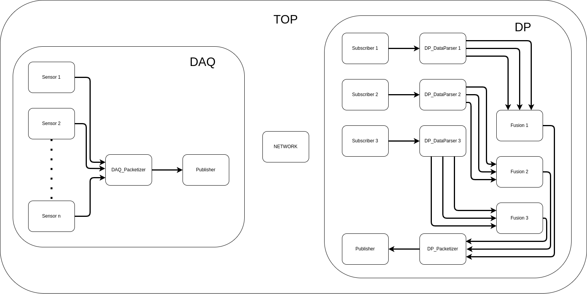

# DEVS Network Distributed Embedded Systems


## Installing Dependancies

Clone this repo into an empty folder, ensure you download the MBed submodules:

`git submodule update --init --recursive`

Run this to install dependencies

`DAQ_DP_Networking/install.sh`


## Running the Simulation

```
cd DAQ_DP_Networking/top_model/
make all
```

This will run the standard Cadmium simulator. Cadmium logs will be generated in DAQ_DP_Networking/top_model/MessageOutputs.txt
The outputs of the Publishers are stored in DAQ_DP_Networking/top_model/outputs.
The pin's inputs are stored in DAQ_DP_Networking/top_model/inputs.

## Block Diagram

